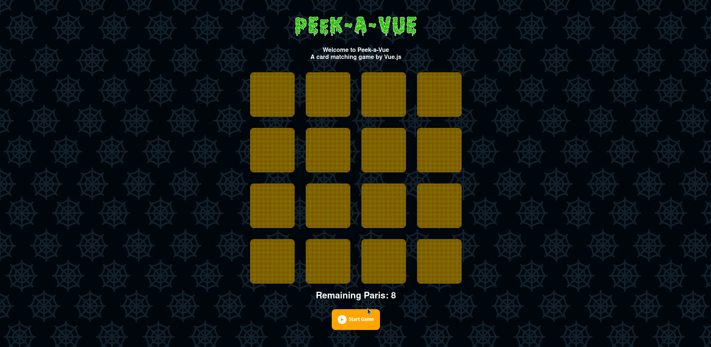
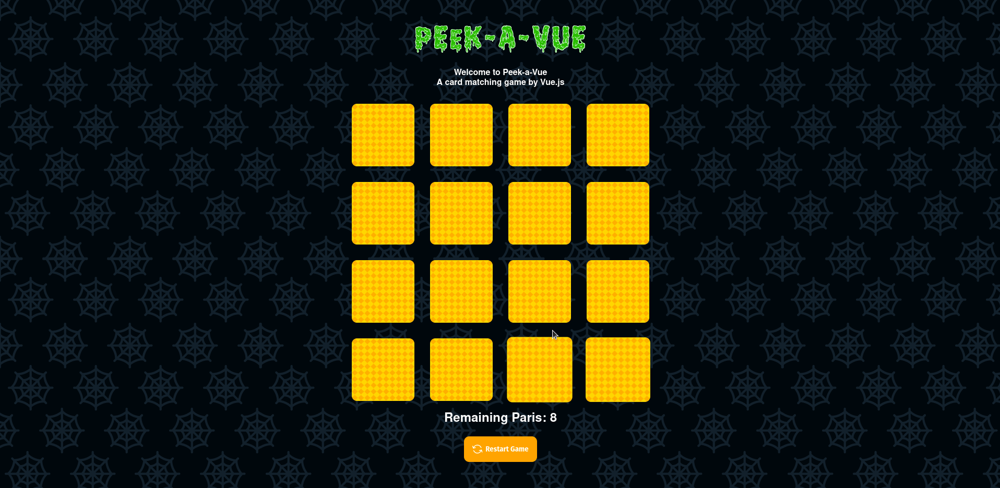
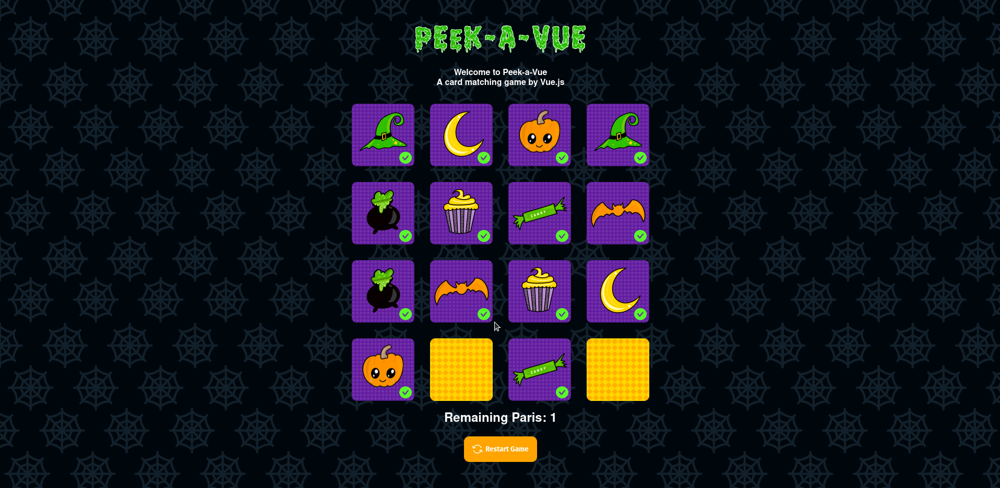

# The-Hellowen-Card-Matching

## Game Created with Vue.js using Composintion api. 


<p>
I carried out this project through classes and studies on the internet, in order to develop and better understand how Vue.js Composition Api is used, I really liked the result and was able to learn a lot during the process.
</p>

<button style="color: #fff; 
                background-color: #ffa500;
                border:none;
                outline:none;
                border-radius: 4px;
                height: 50px;
                display: flex; 
                align-items: center; 
                justify-content:center;">
                <a href="https://616c37b27f9d4f40dcdef356--dazzling-kirch-e0770d.netlify.app/"
                    style="color: #fff; font-weight: bold; font-size: 20px" target="_blank">site is available here</a></button>


[site is available here](https://616c37b27f9d4f40dcdef356--dazzling-kirch-e0770d.netlify.app/ "The best search engine for privacy").
```
Start Game ⬇️⬇️⬇️⬇️⬇️
```


```
finding pairs ⬇️⬇️⬇️⬇️⬇️
```


```
winning and restarting the game ⬇️⬇️⬇️⬇️⬇️
```

